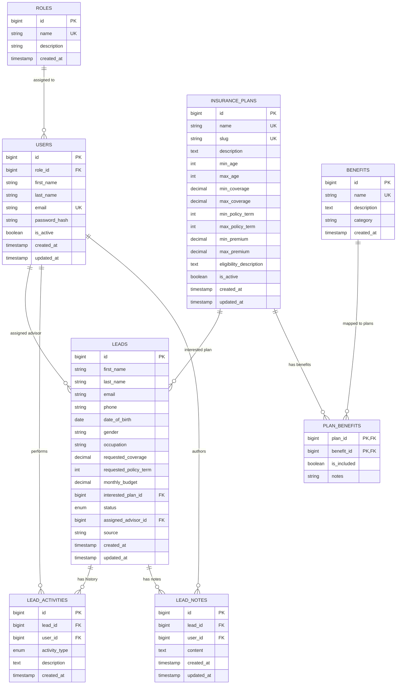

# 🛡️ SecureLife Insurance PLC — Enterprise Portal & Staff CRM

An enterprise-grade, full-stack **PERN** (PostgreSQL, Express.js, React 18, Node.js) web application engineered for **SecureLife Insurance PLC**. The system seamlessly integrates a high-converting public customer website with a powerful, real-time internal staff CRM for lead pipeline management, advisor workload allocation, insurance policy administration, and automated plan recommendation matching.

---

## 🌟 Key Platform Capabilities

### 🌐 1. Public Customer Experience Portal
- **Modern Hero Landing Page**: Features real-time Javascript animated statistics counting up (*Policies in force*, *Average claim payout*, *Years serving families*) and advisor assurance cards.
- **Dynamic Policy Showcase & Side-by-Side Matrix**: Displays active insurance plans (*Basic Term Protection*, *Gold Family Shield*, *Platinum Legacy Wealth*) alongside a **100% database-driven feature matrix table** comparing policy limits, age eligibility, and relational master benefits.
- **Lead Generation Quote Request**: Multi-input lead application form requesting applicant demographics, coverage preferences, and monthly budget — creating real-time entries directly in the PostgreSQL CRM pipeline.

### 💼 2. Internal Staff CRM & Operations Center
- **Real-Time Executive Analytics Dashboard**: Interactive KPI metrics (*Total Leads*, *New Queue*, *Unassigned Leads*, *Converted Policies*, *Active Plans*), a **SQL-aggregated 6-month monthly trend graph**, sales pipeline stage breakdown, and advisor conversion leaderboards.
- **Lead Management Pipeline**: Interactive lead sheet featuring multi-criteria search, status filtering (`NEW` → `CONTACTED` → `QUALIFIED` → `PLAN_RECOMMENDED` → `PROPOSAL` → `CONVERTED` / `LOST`), advisor assignment dropdowns, and status updates.
- **Deterministic Smart Plan Recommendation Engine**: Evaluates applicant age, requested coverage amount, policy term, and monthly budget against active policy parameters, generating match percentage scores (`🥇 100% Match`) and detailed eligibility checklists (`✓ Age within limits`, `✗ Coverage exceeds maximum`).
- **Activity Trail & Internal Notes Audit**: Complete historical record tracking lead lifecycle events, status changes, advisor assignments, and timestamped internal notes.
- **Role-Based Access Control (RBAC)**:
  - **`ADMIN`**: System-wide administrative privileges (analytics, lead assignment, staff account registration, insurance policy configuration, master benefits management).
  - **`ADVISOR`**: Dedicated advisor workspace (assigned lead sheet, pipeline status updates, lead notes, profile configuration).
- **Relational Benefits Normalization**: Architecture separating master insurance benefits (`benefits`) from insurance plans (`insurance_plans`) linked via a join table (`plan_benefits`), allowing flexible assignment of benefits to policy tiers.

---

## 🛠️ Technology Stack

| Layer | Technology | Key Dependencies & Features |
| :--- | :--- | :--- |
| **Frontend UI** | React 18 (CRA) | React Router v7, Bootstrap 5, Lucide React Icons, Native Fetch API |
| **Backend API** | Node.js / Express.js | Express Router, `jsonwebtoken`, `bcrypt`, `express-validator`, `cors`, `helmet` |
| **Database** | PostgreSQL | `pg` connection pool, SQL Aggregations, ENUM types, Foreign Keys with Cascades |
| **Styling & Tokens** | Modular Vanilla CSS | CSS variables design system (`index.css`), zero inline CSS requirement |
| **Architecture** | Single Repository | Modular component decomposition (`components/public`, `components/crm`) |

---

## 📐 System Architecture & Database Schema

All 8 database tables, primary keys, foreign keys, unique constraints, and relationships in PostgreSQL:



---

## 🔒 Security & Enterprise Controls

- **JWT Authentication**: Secure HttpOnly authorization tokens verified via custom middleware (`authenticateToken`).
- **Input Sanitization**: All endpoint inputs validated and HTML-escaped using `express-validator` to prevent XSS.
- **SQL Injection Prevention**: Parameterized database queries (`$1`, `$2`) throughout model layers.
- **Self-Deactivation Guards**: Administrative restrictions preventing logged-in Admins from deactivating or deleting their own active user account.
- **HTTP Security Headers**: Middleware protection via `helmet` and custom `CORS` policy configuration.

---

## ⚡ Quick Setup & Installation Guide

### Prerequisites
- **Node.js**: `v18.0.0` or higher
- **PostgreSQL**: `v12.0` or higher running locally on default port `5432`

---

### 1. Environment Configuration

Ensure the database credentials in `server/.env` match your local PostgreSQL configuration:

```env
PORT=5000
NODE_ENV=development

DB_HOST=localhost
DB_PORT=5432
DB_NAME=securelife_crm
DB_USER=postgres
DB_PASSWORD=1234

JWT_SECRET=securelife_jwt_super_secret_key_2026
JWT_EXPIRES_IN=7d
```

---

### 2. Database Initialization & Automated Seeding

Run the automated seeder script to create the `securelife_crm` database, execute schema DDL, create tables, ENUM types, and seed initial roles, advisors, master benefits, policy plans, and historical leads:

```bash
# From the project root
cd server
npm run db:seed
```

---

### 3. Start Backend Express API Server

```bash
# In terminal 1 (server directory)
cd server
npm start
```
*Backend API server will listen at `http://localhost:5000`.*

---

### 4. Start Frontend React Web Application

```bash
# In terminal 2 (client directory)
cd client
npm start
```
*Frontend React application will open automatically at `http://localhost:3000`.*

---

## 🔑 Demo Access Credentials

| Role | Email Address | Password | Access Rights |
| :--- | :--- | :--- | :--- |
| **System Admin** | `admin@securelife.com` | `Password123!` | Full CRM Administration & Analytics |
| **Lead Advisor** | `advisor.david@securelife.com` | `Password123!` | Assigned Lead Workspace & Notes |
| **Lead Advisor** | `advisor.nadia@securelife.com` | `Password123!` | Assigned Lead Workspace & Notes |
| **Lead Advisor** | `advisor.marcus@securelife.com` | `Password123!` | Assigned Lead Workspace & Notes |
| **Lead Advisor** | `advisor.sarah@securelife.com` | `Password123!` | Assigned Lead Workspace & Notes |
| **Lead Advisor** | `advisor.elena@securelife.com` | `Password123!` | Assigned Lead Workspace & Notes |

---

## 🌐 API Endpoint Quick Reference

| Method | Endpoint | Description | Auth Required |
| :--- | :--- | :--- | :--- |
| `POST` | `/api/auth/login` | Authenticate user & return JWT token | No |
| `GET` | `/api/auth/me` | Fetch authenticated user profile | Yes |
| `GET` | `/api/plans/public` | Fetch active insurance plans for public site | No |
| `POST` | `/api/public/leads` | Submit lead quote enquiry from public site | No |
| `GET` | `/api/dashboard/stats` | Fetch CRM KPI stats, monthly trend & pipeline breakdown | Yes |
| `GET` | `/api/leads` | Fetch pipeline leads list (with filters & search) | Yes |
| `GET` | `/api/leads/:id` | Fetch lead details & smart plan recommendations | Yes |
| `PATCH` | `/api/leads/:id/status` | Update lead pipeline status | Yes |
| `PATCH` | `/api/leads/:id/assign` | Assign lead to an advisor | Admin Only |
| `GET` | `/api/plans/benefits` | Fetch master insurance benefits list | Yes |
| `POST` | `/api/plans` | Create a new insurance policy tier | Admin Only |
| `GET` | `/api/users` | Fetch staff & advisor directory | Admin Only |

---

